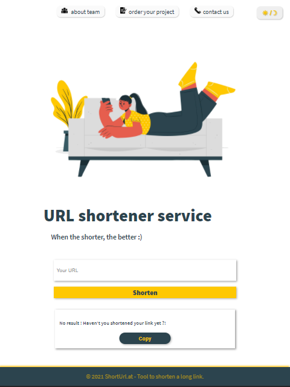
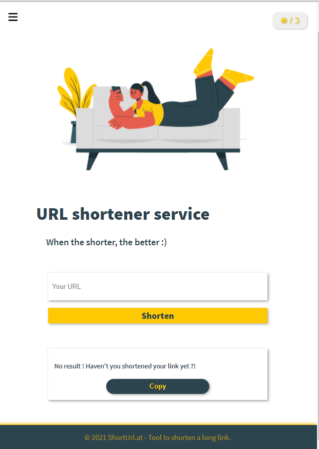

# Name
URL shortner API UI

## Description
This project take user URL and make it short.
in these project used HTML ,css and [axiose library of REACT ](https://github.com/axios/axios#readme) and also [styled components](https://styled-components.com/)


## Installation

Use the [yarn](https://classic.yarnpkg.com/lang/en/docs/install/#windows-stable) for package managing . to install package use these command :

```bash
yarn init
```
and for show result write below command
```bash
yarn start
```
## screenshot
this project design in two mode : lite and dark;
- for desktop 
light mode

dark mode

- for tablet 
light mode 

dark mode

- for mobile
light mode

dark mode


## Usage
- abstract description about how show  shorten URL

when user enter URL in inputbox and press Shorten button the text of bellow section changed and offer user to copy the shorten link. if user didn't enter URL and enter Shorten Button the text of bellow section Does not change.

defined for shotern link
```bash
const [Shorterlink, setShorterLink] = useState("");
```
defined for show message that if there is a shorten link to copy or not.
```
const [showMsg, setShowMsg] = useState("No result ! Haven't you shortened your link yet ?!");
```
and the then a hook for user input and axios for connect to the api and post the url input (with defined format) and return respone
```
userInput = document.getElementById('inpt').value;
axios
.post('http://localhost:3000/links/', objLink, {headers: {'Content-Type': 'application/json'}}).then((res) => {
setShorterLink(`http://localhost:3000/links/${res.data.shortLink}`);
})
.catch();
if (userInput === "") {
   setShowMsg("No result ! Haven't you shortened your link yet ?!")
} else {
   setShowMsg("Copy the shortened link and share it in messages, texts, posts, websites and other locations.");
}
```
- dark mode and light mode 

these option work with: useState hook and theme component(css style defined)
```
const [theme, setTheme] = useState('light');
// The function that toggles between themes
const toggleTheme = () => {
  // if the theme is not light, then set it to dark
  if (theme === 'light') {
    setTheme('dark');
  // otherwise, it should be light
  } else {
    setTheme('light');
  }
```
and Theme.provider tag that include all component and get dark and light style whit props
```
return (
    <ThemeProvider theme={theme === 'light' ? lightTheme : darkTheme}>
       <>
          <GlobalStyles />
          <Header />
          <NavigationBar/>
          <button className='themeBTN' onClick={toggleTheme}> ☀︎  /  ☽ </button>
          <Main />
          <Footer />

       </>
    </ThemeProvider>
  );
```
## Authors and acknowledgment
- owner : Zahra Zafarzade
- mentors : Aien Saidi , Hossein Rahimi and MohammadJavad Hasanzade

## License
[MIT](https://choosealicense.com/licenses/mit/)
